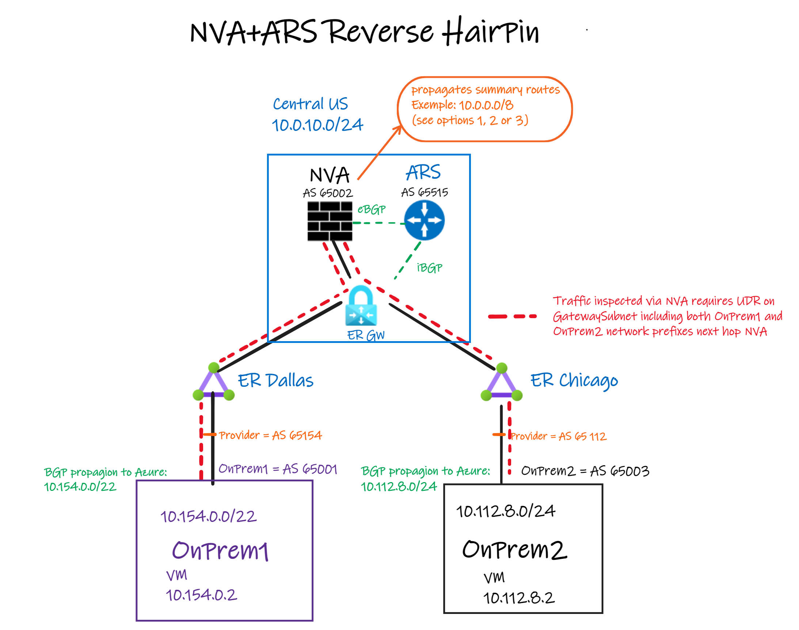
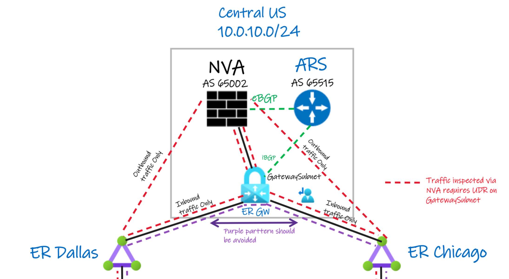
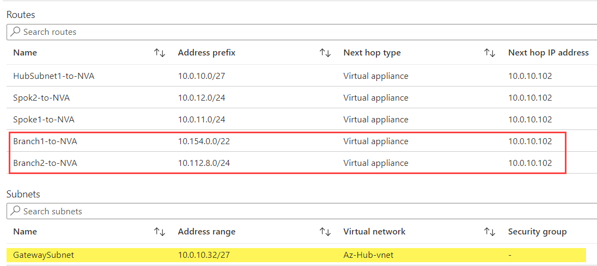

# Transit between ExpressRoute circuits using NVAs and ARS (reverse hairpin)

- [Concepts](#Introduction)
    - [When to use this solution](#When-to-use-this-solution)
    - [Architecture Diagram](#Architecture-Diagram)
    - [Components](#Components)
- [Solution](#Solution)
    - [Routing assessment](#Routing-assessment)
    - [How to handle routing](#How-to-handle-routing)
    - [UDR requirement on GatewaySubnet](#UDR-requirement-on-GatewaySubnet)
    - [Other considerations](#Other-considerations)
- [Lab this solution](#Lab-this-solution)

## Introduction

On this post we're going to go over on how to allow two or more ExpressRoute (ER) circuits to transit traffic between them using Azure Route Server and reverse hairpinning traffic between them.

It is important to mention you can build your Azure network using two models: Hub and Spoke and Virtual WAN. This post will focus on the solution for Hub and Spoke by leveraging Azure Route Server and a network virtual appliance (NVA) to inject routes and create the conditions to the traffic hairpin over the NVA between two remote locations going over ER circuits.

### When to use this solution

This solution is an alternative to others that are already established by having similar goals of allowing transit between two ER circuits such as:

- ER to ER using IPSec VPN (Hub/Spoke using Azure Route Server or Azure Virtual WAN).
- Two Azure VNET Hubs with NVAs and Azure Route Server.

Those other solution are very well documented on Jorge's GitHub repo [Enable Transit Between ExpressRoute Circuits without Using Global Reach](https://github.com/jocortems/azurehybridnetworking/tree/main/ExpressRoute-Transit-with-Azure-RouteServer).

In the same line as others. this solution tries to address the following potential requirements, but not limited to:

- Traffic inspection is required over Azure VNET Hub.
- Global Reach is not available in my location or an ER circuit already Local SKU in place.

## Architecture Diagram

This solution uses an NVA and Azure Route Server by propagating summary routes to "attract" ER circuit traffic by using route summaries and making it hairpin over the NVA to reach both sides.

### Components

The solution demonstrated in this post has the following components:

- Two ExpressRoute circuits connecting connect to both on-premises locations. All ER circuits SKUs are supported including Local.
- There's no routing exchange between circuits but only propagation of the summary routes (details below on how configure the summary routes on the NVA).
- NVA in the Hub injects summary routes using Azure Route Server with branch-to-branch flag enabled.
- An user-defined route (UDR) GatewaySubnet to steer both on-premises traffic to the NVA. That UDR has to use remote branches (Onprem1 and OnPrem2) network IP ranges to allow the traffic to go over the NVA.

## Solution

You need to assess the current customer routing configuration before implementing this solution. That will be important to determine the summary route or potential configuration variations that will be leveraged to the traffic hairpin over the NVA in the Azure Hub.

### Routing assessment

It is important to understand how your customer have their routes configured from On-premises to ensure which summary routes can be added over the NVA to cause the traffic to hairpin over Azure and allow transit between both ER circuits.

1) Customer propagates a summary route such as 10.0.0.0/8  from On-premises to Azure. That can affect directly if that hairpin over NVA on Azure Hub will work or not. In that context, you have to split it into two networks, for example, 10.0.0.0/9 and 10.128.0.0/9.

2) What is the scope of the hairpin via Azure NVA?

    a. Should we have all private traffic to Azure? Should include a summary of all RFC 1918 ranges?

    b. Should we narrow the scope to only allow ER-to-ER transit? In other works, the configuration has to include only the ranges for the remote networks (on-premises)

    c. Should the routing changes be done on the Azure side only or both sides to accommodate the proper traffic hairpin?

There are advantages and disadvantages to each one of the questions listed above, and in the next section, we will get the details on how to make a hairpin configuration based on your requirements.

### How to handle routing

There are multiple ways you can manipulate the routing (summaries) to make sure it will proper hairpin the traffic over the NVA in the Hub.

1) Define wider summary routes such as RFC 1918 ranges. For example, we can make the hairpin by propagating 10.0.0.0/8 for the diagram shared above. The disadvantage of this approach is all 10/8 traffic not used by the customer will be "attracted" to the NVA in Azure Hub which can make some undesired traffic to go to Azure.

2) Narrow the hairpin scope to the ranges that need transit, but make changes on Azure only. On the example shown on the diagram to properly attract the traffic to the NVA on the Azure Hub, you can simply make it slightly wider where On-prem1 has the range 10.154.0.0/22 you can set the NVA to propagate 10.154.0.0/21 and the On-prem2 with a range of 10.112.8.0/24 by configuring 10.112.8.0/23. The disadvantage of this approach is similar to the one explained in item 1, but with the difference of much narrow impact.

3) Narrow the hairpin scope to the ranges that need transit, but changes are required to be done on Azure as well as on-premises. In this case, you have to split On-premises networks in two, by making their propagation more specific, compare to the one used in Azure. For example, using the diagram above, from Onprem1 you can propagate 10.154.0.0/22 in two of /23s, leaving the /22 to be configured in the NVA on the Azure side for the hairpin. While in Onprem2 you can propagate 10.112.8.0/24 in two of 25s, leaving the /24 to be configured on the NVA in the Azure Hub.

You can also have a hybrid approach on mixing items 2 and 3 depending on your requirements and ability to make changes on either side of on-premises networks.

### UDR requirement on GatewaySubnet

This solution requires that n UDR is created on the GatewaySubnet to steer the traffic to the NVA in the Azure Hub.

In case the UDR is not configured in the GatewaySubnet, the traffic hairpin will work, but that traffic will go over ER Gateway (shown as purple line flow on the diagram below). However, that is not recommended approach. Because it causes a direct performance impact on the ER Gateway when making outbound connections to the On-premises networks. Also, ER Gateway was not designed to accommodate that traffic pattern. Therefore, the recommended approach is to move that role to the NVA, which will make the outbound traffic directly to the MSEE routers (shown as outbound only on the diagram below). That will be possible by enforcing UDR on the GatewaySubnet using the IP ranges of the networks connected over on-premises via ER circuit.

#### UDR configuration

Looking at the first diagram we have two On-premises locations using 10.154.0.0/22 (OnPrem1) and 10.112.8.0/24 (OnPrem2). In that scenario you have to set a UDR on the GatewaySubnet and add two routes to the NVA IP or Load Balancer IP as next hop. For example, below he have both remote Branches routes representing both on-premises. The same UDR is associated to the GatewaySubnet.

The [LAB](#lab-this-solution) covers that in more details.

### Other considerations

- **ER FastPath** - Because UDR is required for this solution to work, at this time ExpressRoute [FastPath](https://docs.microsoft.com/en-us/azure/expressroute/about-fastpath#limitations) is not supported.
- **AVS/SAPHLI/Skytap** - This solution can also be used for other scenarios that have connectivity using ExpressRoute such as Azure VMware Solutions (AVS), SAP Hana Large Instances (SAP HLI), or Skytap.

## Lab this solution

Follow the steps to lab this solution in [ER to ER transit using NVAs/ARS and reverse hairpin](https://github.com/dmauser/azure-expressroute/tree/main/er-to-er-transit/ars/lab)

## Closing

Thanks for reading, and we hope the information shared here was helpful. Feedback is always welcome to improve this content (feel free to send a PR or open an issue). I want to express my special thanks to [Heather Sze](https://github.com/hsze) and all the members of the Azure Networking GBB who also had participated by providing valuable feedback on this content.
